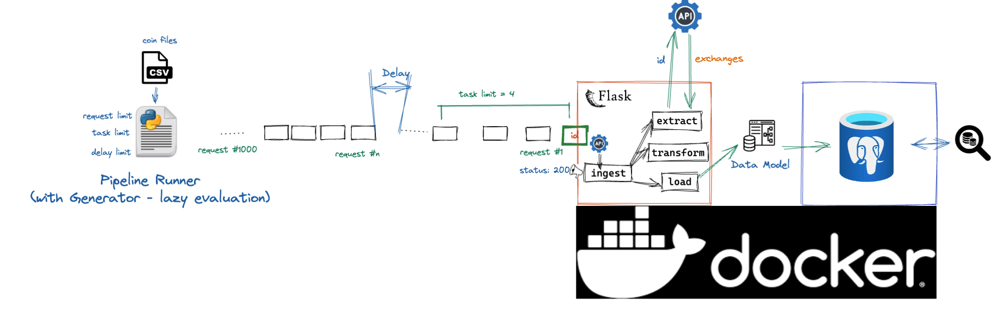

# Alaffia Software Engineering Challenge
### Author: Zhongyuan Li
### Date: 2022/08/27

## Overview
This is the code for Alaffia API challenge.
In this repo, a pipeline is created to receive POST request, and then retrieve exchanges for a coin, save all the result to a postgres DB.




## API Service Files
- **app.py**: API file running with FLASK, which receives POST request
- **pipeline.py**: Business logic of this pipeline, including 4 functions: ingest_data(), extract(), transform(), load()
- **data_model.py**: Define the data model (Columns and types)

## Pipeline Files
- **pipeline_runner.py**: The script triggering the pipeline to load data
- **coin_file.csv**: The file including all coin ids

## Configuration Files
- **Dockerfile**: Make image for container
- **docker-compose.yml**: Define services and their configurations (pythonapp and DB)
- **requirement.txt**: List all dependencies of this project (python libs)

## How to run it?

### Prerequisites
- Make sure you have Docker and Git installed in your computer

### Set local environment for pipeline
1. Create new project folder
```
mkdir testing_zhongyuan_li
```
```
cd testing_zhongyuan_li 
```
2. Clone code to your local
```
git clone https://github.com/ttddli/alaffia_challenge.git
```
```
cd alaffia_challenge 
```

3. Run your docker app
4. Run the container (with image)

```
docker compose up
```

### Trigger pipeline
1. Directly call API to manually load data into DB
```
curl --location --request POST 'http://localhost:80/coins' \
--header 'Content-Type: application/json' \
--data-raw '{"coins":["bitcoin", "pascalcoin"]}'
```

2. Execute pipeline runner (via Aiflow - BashOperator, Crontab, or Manually trigger)
````
cd testing_zhongyuan_li/alaffia_challenge
````
*Run pipeline_runner by giving request_limit(=1000), task_limit(=4) and delay (=1500ms)*
````
python3 pipeline_runner.py 1000 4 1500
````

3. Response
- *Overall status is 200, if this request only has 200 or 404*
````
200: Status of each ID in this request ([200, 404, 200, 200])
````
- *Overall status is 429 if there is 1+ 429*
````
429: Status of each ID in this request ([200, 429, 429, 429])
````
**You need to increase the delay if you see 429**

### SQL: Check the result:
1. Run Postgres
````
docker exec -it db psql -U postgres
````

2. List all tables
```
\dt
```

3. For each exchange, get the count of distinct coins
```
select UNNEST(string_to_array(exchanges, ',')) as exchange, count(distinct id) as cnt from coin group by 1;
```

4. For each exchange, get the median task_run of those coins
```
select UNNEST(string_to_array(exchanges, ',')) as exchange, (max(task_run) + min(task_run))/2 as median_run from coin group by 1;
```

5. Show all exchanges containing the letter 'x'
```
select * from (select UNNEST(string_to_array(exchanges, ',')) as exchange from coin) as temp where exchange like '%x%'
```

### Notes
#### How to get run_task?
- Using timestamp (big int - Unix time) of api request as run_task value
- This number can be easily collected without any calculation logic
- It can show the sequence of all requests
- There will not be duplicates (with microsecond precision)
````commandline
    task_run = int(datetime.now().timestamp() * 1000000)
````


#### How to handle duplicates records (with same id)?
- Save all records into DB no matter it appeared before or Not
- DB (data model) will handle duplicate records based on the primary key

````
    try:
        load(id, exchanges, taskRun)
    except exc.SQLAlchemyError as e:
        print("Ignore duplicated records")

````

````
  id = db.Column(db.String(80), primary_key=True)
  exchanges = db.Column(db.Text, unique=False, primary_key=False)
  task_run = db.Column(db.BigInteger, unique=False, primary_key=False)
````

#### How to handle invalid id?
````
    if "error" in data and data['error'] == "Could not find coin with the given id":
        return None, 404
````

#### Future improvement: Calling API in Parallel could be used in this project to improve the performance